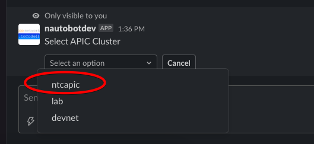

# Cisco ACI Integration Setup

This guide will walk you through steps to set up Cisco ACI integration with the `nautobot_chatops` App.

## Prerequisites

Before configuring the integration, please ensure the following:

- `nautobot-chatops` App was [installed with integration extra dependencies](./index.md#installation-guide).
    ```shell
    pip install nautobot-chatops[aci]
    ```
- `nautobot-chatops` App is set up with at least one [enabled chat platform](./index.md#chat-platforms-configuration) and [tested](./index.md#test-your-chatbot).

## Command Setup

Create a top-level command named `aci` in your enabled chat platform. For detailed instructions related to your specific chat platform, refer to the [platform specific set up](./index.md#chat-platforms-configuration).

## Configuration

You must define the following values in your `nautobot_config.py` file:

| Configuration Setting | Mandatory? | Default |
| --------------------- | ---------- | ------- |
| `enable_aci`          | **Yes**    | False   |
| `aci_creds`           | **Yes**    | {}      |

Below is an example snippet from `development/nautobot_config.py` that demonstrates how to enable and configure Cisco ACI integration:

```python
PLUGINS = ["nautobot_chatops"]

PLUGINS_CONFIG = {
    "nautobot_chatops": {
        ...
        "enable_aci": True,
        "aci_creds": {x: os.environ[x] for x in os.environ if "APIC" in x},
    }
}
```

The `aci_creds` configuration creates a Python dictionary which imports any environment variables prefixed with `APIC`. Define each APIC hostname and credentials using the following environment variables:

```shell
export APIC_USERNAME_NTCAPIC="{{ APIC username }}"
export APIC_PASSWORD_NTCAPIC="{{ APIC password }}"
export APIC_URI_NTCAPIC="{{ https://apic_hostname }}"
export APIC_VERIFY_NTCAPIC="{{ Check SSL certificate (True or False) }}"
```

You can replace `NTCAPIC` in the variable names above with an identifier of your choosing. This identifier will be displayed in the APIC selection dialog when executing commands.



This syntax supports multiple APICs. For instance, to add another APIC to the selection list, specify a second set of credentials:

```shell
export APIC_USERNAME_DEVNET="{{ APIC username }}"
export APIC_PASSWORD_DEVNET="{{ APIC password }}"
export APIC_URI_DEVNET="{{ https://apic_hostname }}"
export APIC_VERIFY_DEVNET="{{ Check SSL certificate (True or False) }}"
```

When executing chat commands, you will be presented with a selection dialog containing both `ntcapic` and `devnet`.

## Upgrading from `nautobot-plugin-chatops-aci` App

!!! warning
    When upgrading from `nautobot-plugin-chatops-aci` App, it's necessary to [avoid conflicts](index.md#potential-apps-conflicts).

- Uninstall the old App:
    ```shell
    pip uninstall nautobot-plugin-chatops-aci
    ```
- Upgrade the App with required extras:
    ```shell
    pip install --upgrade nautobot-chatops[aci]
    ```
- Fix `nautobot_config.py` by removing `nautobot_plugin_chatops_aci` from `PLUGINS` and merging App configuration into `nautobot_chatops`:
    ```python
    PLUGINS = [
        "nautobot_chatops",
        # "nautobot_plugin_chatops_aci"  # REMOVE THIS LINE
    ]

    PLUGINS_CONFIG = {
        # "nautobot_plugin_chatops_aci": {  REMOVE THIS APP CONFIGURATION
        #     "aci_creds": ...  # MOVE THIS LINE TO `nautobot_chatops` SECTION
        # }
        "nautobot_chatops": {
            # Enable Cisco ACI integration
            "enable_aci": True,
            # Following line is moved from `nautobot_plugin_chatops_aci`
            "aci_creds": {x: os.environ[x] for x in os.environ if "APIC" in x},
        }
    }
    ```

Environment variables for this integration are the same for both, old and new configuration.
