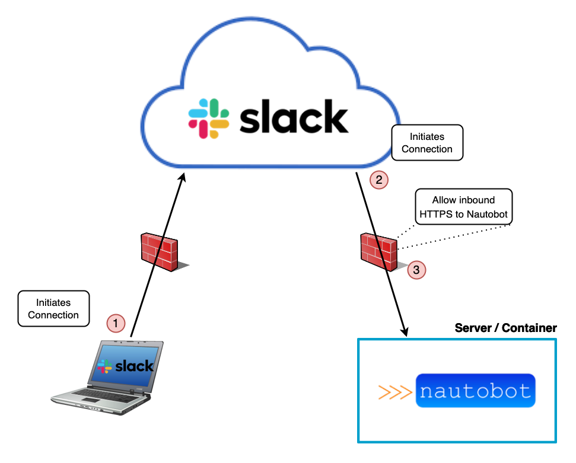
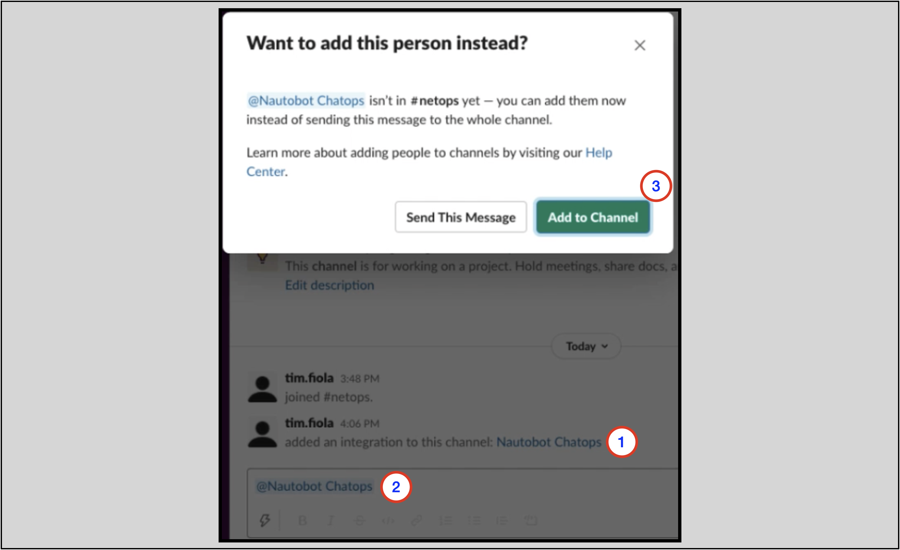

# Slack Setup

These are the four distinct configuration values you will need to configure in `nautobot_config.py`.

| Configuration Setting        | Mandatory? | Default |
| ---------------------------- | ---------- | ------- |
| `enable_slack`               | **Yes**    | False   |
| `slack_api_token`            | **Yes**    | --      |
| `slack_app_token`************| Socket Mode| --      |
| `slack_signing_secret`       | **Yes**    | --      |
| `slack_slash_command_prefix` | No         | `"/"`   |
| `slack_socket_static_host`   | No         | --      |

These values will be used in the `nautobot_config.py` file, once we get to the section where we cover server configuration.
For now, take a mental note that in this section where we are configuring the Slack application, we will need to explicitly note the
`slack_api_token` and `slack_signing_secret` values when they are presented.

Example config snippet from `nautobot_config.py` for configuring ChatOps with Slack:

```python
# Enable installed plugins. Add the name of each plugin to the list.
PLUGINS = ["nautobot_chatops"]

PLUGINS_CONFIG = {
    'nautobot_chatops': {
        'enable_slack': True,
        'slack_api_token': '<slack-api-token>',
        'slack_signing_secret': '<slack-signing-secret>',
    }
}
```

!!! info
    When running Slack in Socket Mode, Nautobot ChatOps Plugin can specify where the static files are hosted.
    This is helpful for giving Slack access to only the server hosting Nautobot Static Files. If Django Storage
    is configured, Nautobot ChatOps Plugin will use the static host from Django Storage. This is optional as
    ChatOps only uses static files for sending logos with messages. To configure the static files host, use
    `slack_socket_static_host` ex. `slack_socket_static_host: 'https://example.com/static/'`.

## Connecting to Slack

The Nautobot ChatOps plugin supports two methods of communicating with Slack.

1. Incoming Webhooks
2. Socket Mode

The original supported method of connection was only incoming webhooks. As of version 1.10, socket mode support was added for Slack.

### Webhooks vs. Socket Mode

With incoming webhooks, whenever a user sends a message to the bot via the client application (phone or desktop app), (1) the connection is initiated from the client, and the message gets sent to Slack's cloud. The Slack servers then initiate a connection to the ChatOps plugin running on the Nautobot server (2). Since this is a new, incoming connection, it must be port forwarded and allowed through any firewalls in your network between the internet and your Nautobot server (3). Nautobot then replies to the existing connection to Slack, which in turn forwards the response to the client.



With socket mode, the Nautobot server will instead maintain a connection to the Slack cloud, initiating the connection *from* the Nautobot server itself (1). In this manner, externally facing firewalls do not need to allow inbound traffic from Slack to the Nautobot server. They only need to allow traffic outbound from the Nautobot server to Slack. Once a client sends a message to the bot (2), Slack forwards the message to Nautobot over the existing websocket connection (3). Nautobot then replies over the existing websocket connection to Slack, and Slack forwards the response to the client.


While there are sufficient ways of securing inbound API requests from the public internet (e.g. using a secure web API gateway), using socket mode is generally easier to set up from a network and netsec perspective, especially for companies that do not currently have a web API gateway installed, or are unfamiliar with them.

## Create Slack App using a Manifest

**Important** - In step 3, you *must* configure the manifest differently depending on if you are using Socket mode or not.

1. Log in to [https://api.slack.com/apps](https://api.slack.com/apps) and select "Create New App". Select "From an app manifest."
2. Select your preferred Slack workspace for your app.
3. In the window titled "Enter app manifest below," select the "YAML" formatting tab and copy/paste the contents of file [nautobot_slack_manifest.yml](https://github.com/nautobot/nautobot-plugin-chatops/blob/develop/setup_files/nautobot_slack_manifest.yml) in the root of this repo. Update the below settings, then click Next.
   - On line 5, you can change the name of the Chatbot here. By default it is set to `Nautobot`
   - If using Socket mode:
      - On line 34, update `socket_mode_enabled` to `true`
   - If not using Socket mode:
      - On line 12, under setting `features/slash_commands/url`, update `<your-URL>` with a publicly accessible URL to your Nautobot server. Note: The trailing `/api/plugins/...` are required.
      - Repeat this for line 31, under setting `settings/interactivity/request_url`
      - On line 34, verify `socket_mode_enabled` is set to `false`
4. Review the summarized settings on the next window and click Create.
5. On the General --> Basic Information page, note the `Signing Secret` near the bottom, under App Credentials. This will be needed later for setting `SLACK_SIGNING_SECRET`.
6. On this same Basic Infomration page, select `Install to Workspace`. Select a channel to allow the app to post to (e.g. #general), and click `Allow`.
   - If you are not a Slack admin, this step will require approval first from an Slack admin in your company.
7. If using Socket mode:
   - Under Settings --> Basic Informmation, scroll down to section "App-Level Tokens" and click `Generate Token and Scopes` to generate an API token.
      - **Token Name**: This can be anything you want.
      - **Scopes**: Click `Add Scope` and select the option `connections:write`.
   - Click `Generate`. Copy this API token. This will be needed later for setting `SLACK_APP_TOKEN`.
8. Under Settings --> Install App, copy the `Bot User OAuth Token` here. This will be needed later for setting `SLACK_API_TOKEN`.
9. Continue with below section "Post App-Creation Steps"

> **Optional:** You can configure the App Icon on the General --> Basic Information page. Under `App Icon`, select "Choose File." You can use the supplied icon [nautobot_chatops_icon.png](https://github.com/nautobot/nautobot-plugin-chatops/blob/develop/setup_files/nautobot_chatops_icon.png).

## Post App-Creation Steps

### Configuration Examples

Before continuing to the general install guide (linked below), you will need the token(s) and secret you previously generated.

In your `nautobot_config.py` file, the following `PLUGINS` and `PLUGINS_CONFIG` variables will need to look simlar to this:

```python
PLUGINS = ["nautobot_chatops"]

PLUGINS_CONFIG = {
    "nautobot_chatops": {
        "enable_slack": True,
        "slack_api_token": "<slack-api-token>",
        "slack_app_token": "<slack-app-token>",
        "slack_signing_secret": "<slack-signing-secret>",
        "slack_slash_command_prefix": "/",
    }
}
```

The `slack_app_token` is *only* used if you are using Socket mode when setting up your chatbot. Otherwise it can be safely ignored.

You can also set these values as environment variables, and use the example listed below. Note the environment variables are all uppercase.

```python
PLUGINS = ["nautobot_chatops"]

PLUGINS_CONFIG = {
    "nautobot_chatops": {
        "enable_slack": True,
        "slack_api_token": os.environ.get("SLACK_API_TOKEN"),
        "slack_app_token": os.environ.get("SLACK_APP_TOKEN"),
        "slack_signing_secret": os.environ.get("SLACK_SIGNING_SECRET"),
        "slack_slash_command_prefix": os.environ.get("SLACK_SLASH_COMMAND_PREFIX", "/"),
    }
}
```

### Invite Chatbot to Channels

> **Note**: In the Slack app, you will need to invite the chatbot to each channel that it will belong to with `@<app name>`.
> For example, when an app named `Nautobot ChatOps` is installed to the workspace:
>
> 1. A message is displayed in the channel, saying that the integration`Nautobot ChatOps` has been added
> 2. You `@Nautobot ChatOps` in the channel
> 3. You are prompted to add `@Nautobot ChatOps` to the channel



Once these steps are completed, you can proceed to the [Install Guide](index.md#Install-Guide) section.

## Configuring Multiple Chatbots in a Workspace

Chatbots from multiple Nautobot implementations can exist in a single Slack workspace and even channel.

They will be differentiated in the workspace using the `slack_slash_command_prefix` value in `PLUGINS_CONFIG`.

Here is an example `nautobot_config.py` for the first Nautobot chatbot implementation in the workspace. This chatbot will be called in the workspace using `/nautobot`.

```python
# Enable installed plugins. Add the name of each plugin to the list.
PLUGINS = ["nautobot_chatops"]

PLUGINS_CONFIG = {
    "nautobot_chatops": {
        "enable_slack": True,
        "slack_api_token": "<slack-api-token>",
        "slack_signing_secret": "<slack-signing-secret>",
    }
}
```

Here is an example `nautobot_config.py` for a second Nautobot chatbot implementation in the workspace.
This configuration explicitly configures the `slack_slash_command_prefix` key/value.
This chatbot will be called in the workspace using `/network2-nautobot`.

```python
# Enable installed plugins. Add the name of each plugin to the list.
PLUGINS = ["nautobot_chatops"]

PLUGINS_CONFIG = {
    "nautobot_chatops": {
        "enable_slack": True,
        "slack_api_token": "<slack-api-token>",
        "slack_signing_secret": "<slack-signing-secret>",
        "slack_slash_command_prefix": "/network2-"
    }
}
```

> NOTE: by default, your slash command must end with `nautobot`. If no `slack_slash_command_prefix` is specified,
> the slash command will be `/nautobot`. If a `slack_slash_command_prefix` is specified, the slash command will be `<slack_slash_command_prefix>nautobot`.

> NOTE: Custom chatbot development allows for chatbot slash commands such as `/grafana` and `/meraki`.

## General Chat Setup Instructions

See [admin_install](index.md) instructions here for general plugin setup instructions.

## Startup Slack Sockets (Socket Mode)

Socket Mode requires it's own Worker in order poll Slack for new slash commands and interactions. Slack Socket Mode supports up to 10 active connections. To start a new connection there is a new Management Command provided.

### start_slack_socket Management Command

`nautobot-server start_slack_socket`

Start a worker to connect to Slack.

### Slack Socket Systemd Service

To establish the `systemd` unit file for the Slack Socket worker, copy and paste the following into `/etc/systemd/system/nautobot-chatops-slack-socket.service`:

```ini
[Unit]
Description=Nautobot Chatops Slack Socket Worker
Documentation=https://docs.nautobot.com/projects/chatops/en/latest/
After=nautobot.service
Wants=network-online.target

[Service]
Type=exec
Environment="NAUTOBOT_ROOT=/opt/nautobot"

User=nautobot
Group=nautobot
WorkingDirectory=/opt/nautobot

ExecStart=/opt/nautobot/bin/nautobot-server start_slack_socket

Restart=always
RestartSec=30
PrivateTmp=true

[Install]
WantedBy=multi-user.target
```

This can be done multiple times to create more workers. Up to 10 workers can be created.

### Configure systemd

Because we just added new service files, you'll need to reload the systemd daemon:

```no-highlight
sudo systemctl daemon-reload
```

Then, start the `nautobot-chatops-slack-socket` services and enable it to initiate at boot time:

```no-highlight
sudo systemctl enable --now nautobot-chatops-slack-socket
```

## Deprected - Create Slack App without a Manifest (original method)

While this method is still possible, we recommend using the App Manifest method (described above) to install your Slack App.

1. Log in to [https://api.slack.com/apps](https://api.slack.com/apps) and select "Create New App".
   - Select "From scratch"
   - Enter "Nautobot ChatOps" as the "App Name"
   - Select your preferred Slack workspace for your app
   - Click "Create App"
2. On the "Basic Information" page for your app, under "Add features and functionality", select "Interactive Components"
   - Set the toggle to "On"
   - Enter the HTTPS URL of the Slack `interaction` endpoint for your Nautobot installation - it should be something
     like `https://<server>/api/plugins/chatops/slack/interaction/` (note the trailing slash)
   - Select "Save Changes"
3. On the "Basic Information" page for your app, under "Add features and functionality", select "Slash Commands"
   - Decide now whether your setup requires a slack slash command prefix to disambiguate this bot's commands from those understood
     by other bots (such as if you have multiple older Nautobot ChatOps versions also enabled), such as `/nautobot-` or `/network2-`
   - This part is a bit tedious, but for each supported command (e.g. `/nautobot`, `/grafana`) you will need to:
     - Select "Create New Command"
     - Enter the command text, the request URL (`https://<server>/api/plugins/chatops/slack/slash_command/` in all cases),
       and the description and usage hints
     - Select "Save"
   - It's up to you whether to configure only the top-level commands (`/nautobot`, etc.) or whether
     you wish to configure all of the sub-commands as slash-commands as well (`/nautobot-get-devices`, `/nautobot-get-facts`,
     etc.). The sub-commands can always be entered as parameters to the top-level commands in any case
     (`/nautobot get-devices`) whether or not you also define them as first-class slash-commands in their own right.
   - TODO: we need a helper script that could be easily run to generate a full listing of subcommands so that a new
     deployer can know what all they need to set up!

> Note: if you want to interact with Nautobot to retrieve data without doing any custom code development, your slash command must
> be `/nautobot` or end with `nautobot` following the configured slack_slash_command_prefix. For example, the
> `/network2-nautobot` command would have a `slack_slash_command_prefix` of `/network2-`

4. On the "Basic Information" page for your app, under "App Credentials", find the "Signing Secret" and click "Show".
   You will need to configure this value for the plugin as the `slack_signing_secret` value, such as through an
   `.env` file. If this value is not correctly configured, the bot will be unable to validate that inbound
   notifications it receives have been properly signed by the Slack server.
5. In the sidebar to the left, select "OAuth & Permissions".
   - Under "Scopes", select "Add an OAuth Scope", and add the following scopes:
     - `chat:write`
     - `commands`
     - `channels:read`
     - `files:write`
     - `incoming-webhook`
     - `users:read`
     - `app_mentions:read`
     - `groups:read`
     - `im:read`
     - `mpim:read`
   - At the top of this page, select "Install App to Workspace" and confirm it.
   - There should now be a "Bot User OAuth Access Token" displayed, typically a string starting with `xoxb-`.
     You will need to configure this value for the plugin as the `slack_api_token` value, either directly or through an
     `.env` file. If this value is not properly configured, the bot will be unable to send content to the user.
6. Returning to the "Basic Information" page for your app, under "Display Information", you can specify the name,
   description, icon, and accent/background color for the app. You can use the `nautobot_logo.png` from this
   directory if desired.
7. Continue with below section "Post App-Creation Steps"
