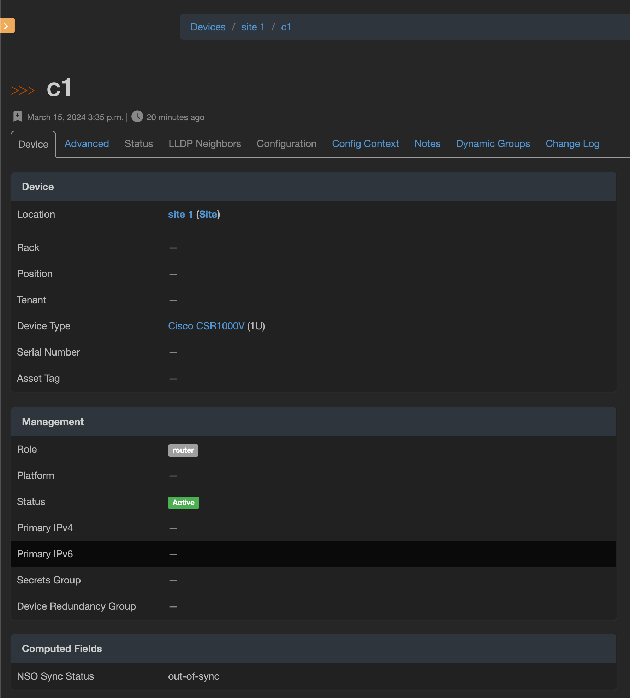

# Cisco NSO Integration Setup

This guide will walk you through steps to set up Cisco NSO integration with the `nautobot_chatops` App.

## Prerequisites

Before configuring the integration, please ensure the following:

- `nautobot-chatops` App was installed.
    ```shell
    pip install nautobot-chatops
    ```
- `nautobot-chatops` App is set up with at least one [enabled chat platform](../install.md#chat-platforms-configuration) and [tested](./../install.md#test-your-chatbot).
- [Cisco NSO](https://developer.cisco.com/docs/nso-guides-6.2/#!installation/installation) application installed and configured.

## Command Setup

Create a top-level command named `nso` in your enabled chat platform. For detailed instructions related to your specific chat platform, refer to the [platform specific set up](../install.md#chat-platforms-configuration).

## Configuration

You must define the following values in your `nautobot_config.py` file:

| Configuration Setting | Mandatory? | Default | Notes | Available on Admin Config |
| --------------------- | ---------- | ------- | ----- | ------------------------- |
| `enable_nso` | **Yes** | False | Enable Cisco NSO integration. | Yes |
| `nso_url` | **Yes** | | Base url that the Cisco NSO application is hosted at. | No |
| `nso_username` | **Yes** | | Cisco NSO username. | No |
| `nso_password` | **Yes** | | Cisco NSO password. | No |
| `nso_request_timeout` | | 60 | Timeout of the API request to Cisco NSO. | No |

Below is an example snippet from `development/nautobot_config.py` that demonstrates how to enable and configure Cisco NSO integration:

```python
PLUGINS = ["nautobot_chatops"]

PLUGINS_CONFIG = {
    "nautobot_chatops": {
        ...
        "enable_nso": True,
        "nso_url": os.environ.get("NSO_URL"),
        "nso_username": os.environ.get("NSO_USERNAME"),
        "nso_password": os.environ.get("NSO_PASSWORD"),
        "nso_request_timeout": os.environ.get("NSO_REQUEST_TIMEOUT", 60),
    }
}
```

## Command Filters

To use the remote command capabilities of NSO Plugin, a command filter needs to be defined. Command filter consist of command regex, device role, and device platform.


## Computed Fields

Optionally, a computed field might be created to display NSO status on a device details page. Please note, that it might delay the page load depending on NSO response time.




