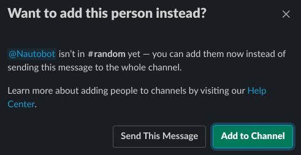

# Installing Nautobot Chatops

## Installation

The plugin is available as a Python package in PyPI and can be installed with `pip3` after logging in with the `nautobot` user account.

```shell
sudo -iu nautobot
pip3 install nautobot-chatops
```

> The plugin is compatible with Nautobot 1.0.0beta1 and higher

Once installed, the plugin needs to be enabled in your `nautobot_config.py`

```python
# In your nautobot_config.py
PLUGINS = ["nautobot_chatops"]

PLUGINS_CONFIG = {
    "nautobot_chatops": {
         #     ADD YOUR SETTINGS HERE
    }
}
```

Nautobot supports `Slack`, `MS Teams` and `Webex Teams` as backends but by default all of them are disabled. You need to explicitly enable the chat platform(s) that you want to use in the `PLUGINS_CONFIG` with one or more of `enable_slack`, `enable_ms_teams` or `enable_webex_teams`.

The plugin behavior can be controlled with the following list of general settings:

| Configuration Setting        | Description | Mandatory? | Default |
| ---------------------------- | ----------- | ---------- | ------- |
| `delete_input_on_submission` | After prompting the user for additional inputs, delete the input prompt from the chat history | No | `False` |

## General setup

Install this plugin into Nautobot and enable it in `nautobot_config.py` under `PLUGINS`, as described in `README.md`.
There are no general mandatory settings in `PLUGINS_CONFIG`, but see below for platform-specific setup requirements.
If you're running Nautobot locally on a laptop or similar, you may need to install and run `ngrok` to provide a
publicly accessible HTTP endpoint for the chat platform(s) to connect to.

## Platform-specific setup

### Setup for Slack

| Configuration Setting        | Mandatory? | Default |
| ---------------------------- | ---------- | ------- |
| `enable_slack`               | **Yes**    | False   |
| `slack_api_token`            | **Yes**    | --      |
| `slack_signing_secret`       | **Yes**    | --      |
| `slack_slash_command_prefix` | No         | `"/"`   |

1. Log in to [https://api.slack.com/apps](https://api.slack.com/apps) and select "Create New App".
   - Enter "Nautobot Chatops" as the "App Name"
   - Select your preferred Slack workspace as the "Development Slack Workspace"
   - Click "Create App"
2. On the "Basic Information" page for your app, under "Add features and functionality", select "Interactive Components"
   - Set the toggle to "On"
   - Enter the HTTPS URL of the Slack `interaction` endpoint for your Nautobot installation - it should be something
     like `https://<server>/api/plugins/chatops/slack/interaction/` (note the trailing slash)
   - Select "Save Changes"
3. On the "Basic Information" page for your app, under "Add features and functionality", select "Slash Commands"
   - Decide now whether your setup requires a command prefix to disambiguate this bot's commands from those understood
     by other bots (such as if you have multiple older Nautobot Chatops versions also enabled), such as `/nautobot-` or `/na-`
   - This part is a bit tedious, but for each supported command (e.g. `/nautobot`, `/grafana`) you will need to:
     - Select "Create New Command"
     - Enter the command text, the request URL (`https://<server>/api/plugins/chatops/slack/slash_command/` in all cases),
       and the description and usage hints
     - Select "Save"
   - It's up to you whether to configure only the top-level commands (`/nautobot`, etc.) or whether
     you wish to configure all of the sub-commands as slash-commands as well (`/nautobot-get-devices`, `/nautobot-get-facts`,
     etc.). The sub-commands can always be entered as parameters to the top-level commands in any case
     (`/nautobot get-devices`) whether or not you also define them as first-class slash-commands in their own right.
   - TODO: we need a helper script that could be easily run to generate a full listing of subcommands so that a new
     deployer can know what all they need to set up!
4. On the "Basic Information" page for your app, under "App Credentials", find the "Signing Secret" and click "Show".
   You will need to configure this value for the plugin as the `slack_signing_secret` value, such as through the
   `.creds.env` file. If this value is not correctly configured, the bot will be unable to validate that inbound
   notifications it receives have been properly signed by the Slack server.
5. In the sidebar to the left, select "OAuth & Permissions".
   - Under "Scopes", select "Add an OAuth Scope", and add the following scopes:
      - `chat:write`
      - `commands`
      - `channels:read`
      - `files:write`
      - `incoming-webhook`
      - `users:read`
      - `app_mentions:read`
      - `groups:read`
      - `im:read`
      - `mpim:read`
   - At the top of this page, select "Install App to Workspace" and confirm it.
   - There should now be a "Bot User OAuth Access Token" displayed, typically a string starting with `xoxb-`.
     You will need to configure this value for the plugin as the `slack_api_token` value, such as through the
     `.creds.env` file. If this value is not properly configured, the bot will be unable to send content to the user.
6. Returning to the "Basic Information" page for your app, under "Display Information", you can specify the name,
   description, icon, and accent/background color for the app. You can use the `nautobot_logo.png` from this
   directory if desired.
7. Proceed to the general process to "Grant access to the chatbot" below.

> **Note** You will need to invite the chatbot to each channel that it will belong to with `@Nautobot`.



### Setup for Microsoft Teams

| Configuration Setting        | Mandatory? | Default |
| ---------------------------- | ---------- | ------- |
| `enable_ms_teams`            | **Yes**    | False   |
| `microsoft_app_id`           | **Yes**    | --      |
| `microsoft_app_password`     | **Yes**    | --      |

#### Azure

1. Login to [https://portal.azure.com](https://portal.azure.com) and select "Create a Resource".
2. Use the search box to locate "Bot Channels Registration", then select "Bot Channels Registration" under section Marketplace.
3. Configure the bot handle, subscription, resource group, and location. Create new resource group. It can be named the same as the bot handle for simplicity.
4. Be sure to select the "F0" (free) pricing tier, rather than the default "S1" paid tier.
5. For the "Messaging endpoint", enter your service URL (`https://<server>/api/plugins/chatops/ms_teams/messages/`)
6. Select "Create" and wait for the "Deployment succeeded" pop-up to appear in your browser.
7. Once completed, in the top search bar, enter "Bot Services", then select "Bot Services" under section "Services". Select the name of the bot you just created (not the resource group).
8. In the sidebar to the left, select "Channels" and select the "Microsoft Teams" icon, labeled "Configure Microsoft Teams channel". All of the default settings here are fine, so just click "Save".
9. In the sidebar to the left, under Settings, select "Configuration". Copy the "Microsoft App ID" that is displayed (it's greyed out, but can be selected for copying), then click the "Manage" link above the App ID field.
10. On the new "Certificates & secrets" page, click "New client secret". (You may have to delete one of the existing secrets first, as there is a maximum limit). Copy the newly generated secret, as there's no way to recover it once you leave the page - you will have to return to this page and generate a new secret if you lose it.

#### MS Teams Client

1. Now to deploy the bot to your team. In the Microsoft Teams client, select "Apps" from the sidebar to the left.
2. Use the search bar to find "App Studio" and select and open it. If it isn't currently installed, install it first.
3. Select the "Manifest editor" tab at the top of the window.
4. Select "Import an existing app", and upload the `Nautobot_ms_teams.zip` file from this directory.
5. Under section 1 Details, page "App details", update the "App ID" to the value that you took note of in step 8 above.
6. Under section 2 Capabilities, page "Bots", select the Edit button next to the Bot at the top. In the field "Connect to a different bot id", update the "App ID" to the value that you took note of in step 8 above.
7. Under section 3 Finish, page "Test and distribute", Select "Download" to save the app package to your disk.
8. Again select "Apps" in the left sidebar, then "Upload a custom app" at the bottom.
9. Select your updated app package zip file.
10. After a few moments, the Nautobot app will appear in the window. Select it and click "Add".
11. Configure the `microsoft_app_id` and `microsoft_app_password` for the plugin with the App ID and client secret values from step 8 in your `.creds.env` file (on the Nautobot server, not in the MS Teams client).
12. Proceed to the general process to "Grant access to the chatbot" below.

### Setup for WebEx Teams

| Configuration Setting        | Mandatory? | Default |
| ---------------------------- | ---------- | ------- |
| `enable_webex_teams`         | **Yes**    | False   |
| `webex_teams_token`          | **Yes**    | --      |
| `webex_teams_signing_secret` | **Yes**    | --      |

1. Login to [https://developer.webex.com](https://developer.webex.com) and select "Start building apps", then "Create a New App", then "Create a Bot".
   - Enter the bot name, username, icon (you can use `nautobot_logo.png` from this directory), and description,
     and select "Add Bot"
2. Configure the displayed Bot Access Token string as the `webex_teams_token` in your `.creds.env` file.
   It can't be recovered later, so if you lose it you'll need to log in and regenerate a new token.
3. Currently the bot does not automatically register its own webhooks (although this is a capability that WebEx Teams
   provides, TODO?) so you'll need to set them up yourself.
   - Go to [https://developer.webex.com/docs/api/v1/webhooks](https://developer.webex.com/docs/api/v1/webhooks)
   - *For all of these API calls, be sure you deselect "Use personal access token" and instead specify the
     Bot Access Token string as the authorization instead.*
   - If desired, you can use [https://developer.webex.com/docs/api/v1/webhooks/list-webhooks](https://developer.webex.com/docs/api/v1/webhooks/list-webhooks) to query for existing
     webhooks. There should be none if this is a new deployment.
   - Use [https://developer.webex.com/docs/api/v1/webhooks/create-a-webhook](https://developer.webex.com/docs/api/v1/webhooks/create-a-webhook) (again, with the bot access token) to create
     a new webhook with the following parameters:
     - name: "nautobot messages"
     - targetUrl: "https://\<server\>/api/plugins/chatops/webex_teams/"
     - resource: "messages"
     - event: "created"
     - secret: (enter a secret string that you don't mind having passed around as plaintext)
   - Change the `resource` to "attachmentActions" and run the API call again to create a second webhook.
4. Configure the `webex_teams_signing_secret` in your `.creds.env` to match the secret string that you selected in
   step 3 above.
5. Proceed to the general process to "Grant access to the chatbot" below.

### Setup for Mattermost

| Configuration Setting        | Mandatory? | Default |
| ---------------------------- | ---------- | ------- |
| `enable_mattermost`          | **Yes**    | False   |
| `mattermost_api_token`       | **Yes**    | --      |
| `mattermost_url`             | **Yes**    | --      |

1. Login to your instance of Mattermost and select Integrations, then click Bot Accounts.
   - Enter the bot username, icon, Display name and Description.
   - Choose the Role for the bot. In order to use Ephemeral posts, you need to choose System Admin.
2. Configure the displayed Access Token string as the `mattermost_api_token` in your `.creds.env` file.
   It can't be recovered later, so if you lose it you'll need to log in and regenerate a new token.
3. Go back to Integrations, then click Slash Commands.
   - Click Add Slash Command, filling out the Title, Description, Command Trigger Word
   - Set the Request URL to `https://<server>/api/plugins/chatops/mattermost/slash_command/`
   - Click Save.
4. Configure the displayed Token following the guide for "Add Command Token to database" below.
   - The Command will be `Command Trigger Word` from step 3.
   - Use the token displayed from step 3, you can access this token from Mattermost at any time.
5. Configure `mattermost_url` with the URL for your Mattermost instance.
   - To get this from within the client go to the Server Management:
     - From Windows `file - settings`
     - From Mac `Mattermost - preferences`
   - Copy the displayed url matching the Server you want to add the chatbot to.
     - Make sure to include the `http://` or `https://`.
     - If shown, make sure to include the port. Ex. `https://example.com:8065`
6. Proceed to the general process to "Grant access to the chatbot" below.

**Note:** For every Slash Command created for Mattermost, a separate token will be generated.

## Add Command Token to database

Nautobot provides an HTTP endpoint(s) for each supported chat platform.
These endpoints implement authentication to prevent arbitrary HTTP requests from being accepted.
Some platforms this `signing_secret` is valid for all commands, other platforms, such as Mattermost,
create a seperate `token` for every slash command.  Keeping the records for Mattermost tokens in the
`.creds.env` file would not be sustainable.  

To solve this issue, the plugin has the option to store Command Tokens to the Nautobot Database.
In Nautobot, open Nautobot and go to the Plugins and select Command Tokens. Below is an example to
get you started.

### Example: Adding tokens for Mattermost

Here is an example that supports Mattermost.

| Platform    | Comment   | Token            |
| ----------- | ---------- | ---------------- |
| Mattermost  | `nautobot`   | `x0xb5hj5ga5tge` |
| Mattermost  | `clear`    | `x7g7ag9ohkafbe` |

**Note:** The Comment field is optional and used to help the user when there are multiple tokens.

## Grant access to the chatbot

Nautobot provides an HTTP endpoint(s) for each supported chat platform.
Although these endpoints do implement authentication to prevent arbitrary HTTP requests from triggering bot actions,
they can accept and act on any validly-formed request from the chat platform, which could originate from any
organization, team, channel, or user who has access to the chat system.

For most realistic deployments, open and unrestricted access to the bot from any chat account is undesirable.
Therefore, in this version, access to the chatbot defaults to "deny all" when initially installed, but varying scopes
(per organization, per channel, per user) and degrees (all commands, all subcommands of a single command,
single subcommand of a single command) of access can be granted through Nautobot.

The access grants are maintained in Nautobot's database for persistence, and are change-logged like other Nautobot records.


Note that access grants are based on the chat platform's internal ID values for users, channels, and organizations;
although you can and should attach a user-friendly name to each access grant for reference, it is the ID value that
is actually enforced by Nautobot. On some platforms and for some access scopes, the Nautobot UI "Look up Value from Name"
button can be used to auto-discover the ID value corresponding to a given name; if this fails, you can always attempt
to send a request to Nautobot from the desired user/channel/organization and retrieve the ID value from the resulting
error message to use to define a new access grant.

The specific access grants you will want to define will depend on your operational requirements,
but some examples are provided below to help you get started.

### Example: unrestricted access within a single organization

In the simplest realistic configuration example, access to all chatbot commands is granted for all users and
all channels in a single organization scope.

| Command | Subcommand | Grant type   | Name   | Value       |
| ------- | ---------- | ------------ | ------ | ----------- |
| `*`     | `*`        | organization | my-org | `T202B88NN` |
| `*`     | `*`        | channel      | any    | `*`         |
| `*`     | `*`        | user         | any    | `*`         |

### Example: split command access to different channels

In this example, Nautobot is providing two separate command groupings, each of which is intended for use by a
different team within the organization. Each team has a dedicated channel on the chat platform, to which access is
already controlled by other means, so we can allow all users within a given channel access.

| Command   | Subcommand | Grant type   | Name    | Value       |
| --------- | ---------- | ------------ | ------- | ----------- |
| `*`       | `*`        | organization | my-org  | `T202B88NN` |
| `support` | `*`        | channel      | support | `C2020H455` |
| `devops`  | `*`        | channel      | devops  | `C3030I566` |
| `*`       | `*`        | user         | any     | `*`         |

### Example: restrict specific command and subcommand to specific users in a specific channel

In this example, Nautobot has a potentially-destructive subcommand that should only be used by a handful of admin users.
Other subcommands under this subcommand can be used by anyone in the devops channel.
Other commands are harmless fun and can be used by any user in the organization in any channel.

| Command   | Subcommand | Grant type   | Name    | Value       |
| --------- | ---------- | ------------ | ------- | ----------- |
| `*`       | `*`        | organization | my-org  | `T202B88NN` |
| `jokes`   | `*`        | channel      | any     | `*`         |
| `jokes`   | `*`        | user         | any     | `*`         |
| `network` | `*`        | channel      | devops  | `C3030I566` |
| `network` | `history`  | user         | any     | `*`         |
| `network` | `redeploy` | user         | admin1  | `U2049K991` |
| `network` | `redeploy` | user         | admin2  | `U2039K725` |
| `network` | `redeploy` | user         | admin3  | `U7924K784` |
| `network` | `status`   | user         | any     | `*`         |
| `weather` | `*`        | channel      | any     | `*`         |
| `weather` | `*`        | user         | any     | `*`         |
