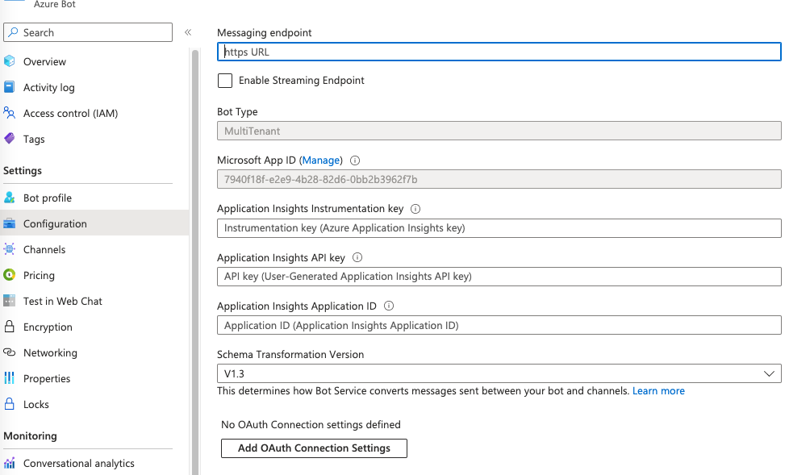
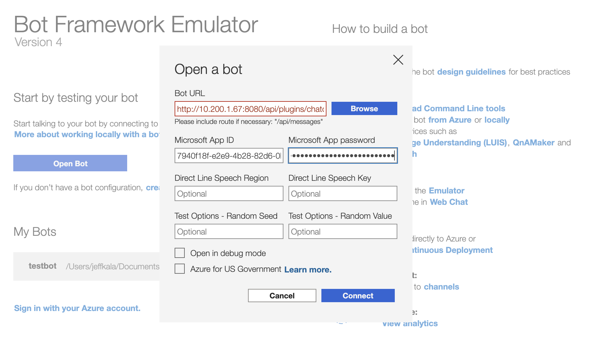
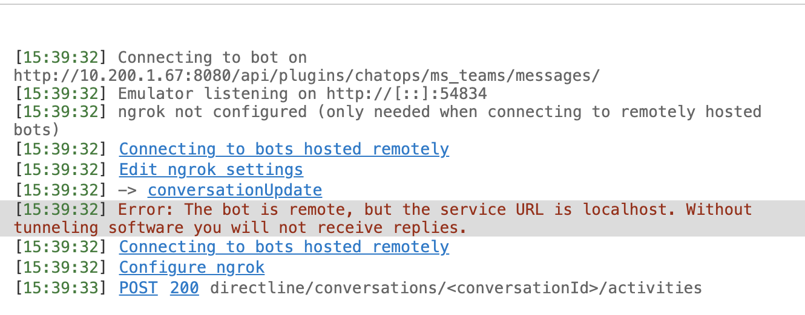
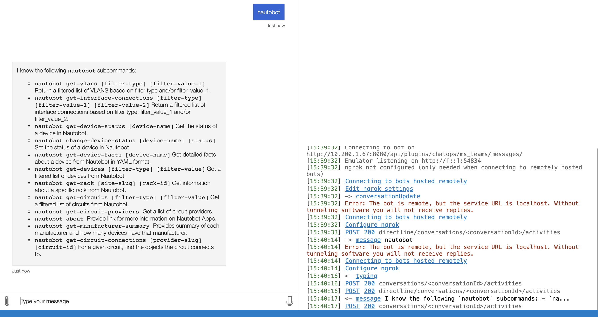
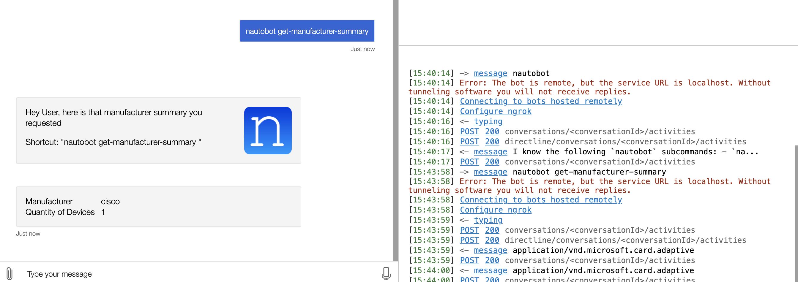

# Extending the App

Nautobot ChatOps includes a plugin system to allow development of new ChatOps commands. The simplest way to get started is to use the [Nautobot ChatOps Cookiecutter](https://github.com/nautobot/nautobot-chatops-cookiecutter). This [blog post on Creating Custom Chat Commands](http://blog.networktocode.com/post/creating-custom-chat-commands-using-nautobot-chatops/) will help.

## Localized Testing

Being able to test new commands while doing initial development is a requirement to ensure everything is functioning appropriately. The two sections below outline a few ways we've found to do this testing.

### Using Mattermost

As part of the Nautobot ChatOps Cookiecutter above there is an invoke task named `setup_local_mattermost_dev_env` which will setup a local mattermost instance for testing. This is a great way to do local development for new ChatOps commands.

### Using Bot Framework Emulator

This option is limited to testing an Azure bot, but allows you to test the bots functionality without the need to create, publish, deploy the bot app into the MS Teams infrastructure.

There are a few requirements to get this up and running, the steps are provided below to help a user get started.

1. Follow the instructions on setting up the [Azure bot](https://docs.nautobot.com/projects/chatops/en/latest/admin/install/microsoft_teams_setup/#azure).

!!! note
    You can skip the `messaging endpoint` definition while testing in the Bot Emulator.

!!! note
    You can also skip adding MS Teams to the channels list.



2. Now that your Azure bot is created, and you've followed all the steps to capture the `Microsoft App ID` and the `Value` from your `Client Secret Key`. You can setup your local development environment. Please follow the standard steps outlined in the [development environment](https://docs.nautobot.com/projects/chatops/en/latest/dev/dev_environment/) section.

!!! warn
    In order for this to work while running on the same host machine you'll need to add the `extra_hosts` option to the nautobot and celery docker compose services. Uncomment the sections from `docker-compose.base.yml` and `docker-compose.celery.yml` files.
    
    ```yaml
    # Uncomment if using Bot Framework Emulator
    extra_hosts:
      - "localhost:host-gateway"
    ```

3. Install Bot Framework Emulator. Based on the OS download and install from GitHub [releases](https://github.com/microsoft/BotFramework-Emulator/releases)

4. Once you install the Bot Framework Emulator, click on `Open Bot` in the center of the home page.  Fill in the `Open a Bot` with the details. In order for authentication to work the `Microsoft App ID` and `Microsoft App password` must be filled out based on the Azure bot steps that were previously captured.



5. Click `connect` and the debugging pane will show that its connecting to the endpoint provided. This step is doing the authentication for the bot.



6. Type `nautobot` and the responses will be similar to what you'd expect if you were interacting with the bot directly from MS Teams client. An example is shown below.



As shown below the commands do operate as expected.


