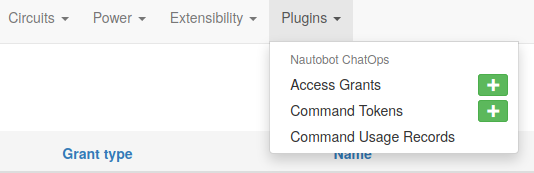

# Access Grants

<!--access-grant-->
Nautobot provides an HTTP endpoint(s) for each supported chat platform.
Although these endpoints do implement authentication to prevent arbitrary HTTP requests from triggering bot actions,
they can accept and act on any validly-formed request from the chat platform, which could originate from any
organization, team, channel(room), or user who has access to the chat system.

For most realistic deployments, open and unrestricted access to the bot from any chat account is undesirable.
Therefore, in this version, access to the chatbot defaults to "deny all" when initially installed, but varying scopes
(per organization, per channel, per user) and degrees (all commands, all sub-commands of a single command,
single sub-command of a single command) of access can be granted through Nautobot.

The access grants are maintained in Nautobot's database for persistence, and are change-logged like other Nautobot records.

Note that access grants are based on the chat platform's internal ID values for users, channels, and organizations;
although you can and should attach a user-friendly name to each access grant for reference, it is the ID value that
is actually enforced by Nautobot. On some platforms and for some access scopes, the Nautobot UI "Look up Value from Name"
button can be used to auto-discover the ID value corresponding to a given name; if this fails, you can always attempt
to send a request to Nautobot from the desired user/channel/organization and retrieve the ID value from the resulting
error message to use to define a new access grant.

The specific access grants you will want to define will depend on your operational requirements,
but some examples are provided below to help you get started.

## Example: Unrestricted Access Within a Single Organization

In the simplest realistic configuration example, access to all chatbot commands is granted for all users and
all channels in a single organization scope.

| Command | Sub-command | Grant type    | Name   | Value       |
| ------- | ---------- | ------------- | ------ | ----------- |
| `*`     | `*`        | organization  | my-org | `T202B88NN` |
| `*`     | `*`        | channel(room) | any    | `*`         |
| `*`     | `*`        | user          | any    | `*`         |

## Example: Split Command Access to Different Channels

In this example, Nautobot is providing two separate command groupings, each of which is intended for use by a
different team within the organization. Each team has a dedicated channel on the chat platform, to which access is
already controlled by other means, so we can allow all users within a given channel access.

| Command   | Sub-command | Grant type    | Name    | Value       |
| --------- | ---------- | ------------- | ------- | ----------- |
| `*`       | `*`        | organization  | my-org  | `T202B88NN` |
| `support` | `*`        | channel(room) | support | `C2020H455` |
| `devops`  | `*`        | channel(room) | devops  | `C3030I566` |
| `*`       | `*`        | user          | any     | `*`         |

## Example: Restrict Specific Command and Sub-command to Specific Users in a Specific Channel

In this example, Nautobot has a potentially-destructive sub-command that should only be used by a handful of admin users.
Other sub-commands under this sub-command can be used by anyone in the devops channel.
Other commands are harmless fun and can be used by any user in the organization in any channel.

| Command   | Sub-command | Grant type    | Name    | Value       |
| --------- | ---------- | ------------- | ------- | ----------- |
| `*`       | `*`        | organization  | my-org  | `T202B88NN` |
| `jokes`   | `*`        | channel(room) | any     | `*`         |
| `jokes`   | `*`        | user          | any     | `*`         |
| `network` | `*`        | channel(room) | devops  | `C3030I566` |
| `network` | `history`  | user          | any     | `*`         |
| `network` | `redeploy` | user          | admin1  | `U2049K991` |
| `network` | `redeploy` | user          | admin2  | `U2039K725` |
| `network` | `redeploy` | user          | admin3  | `U7924K784` |
| `network` | `status`   | user          | any     | `*`         |
| `weather` | `*`        | channel(room) | any     | `*`         |
| `weather` | `*`        | user          | any     | `*`         |
