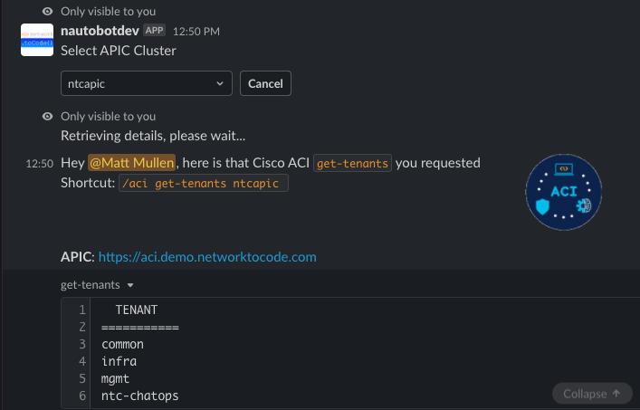
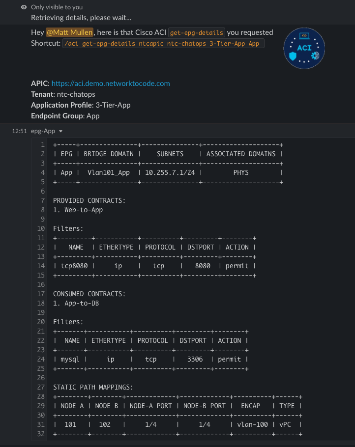
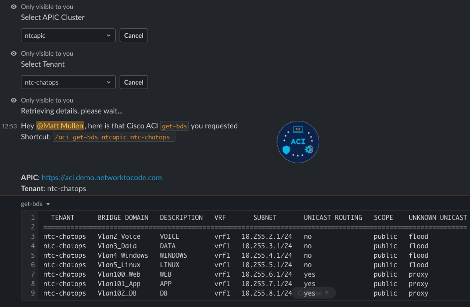

# Cisco ACI Chat Commands

## Screenshots

### Slack

  

### Webex

  

## `/aci` Command

The following sub-commands are prefixed with `/aci`:

| Command | Description |
| ------- | ----------- |
| `get-tenants [APIC]` | Display tenants configured in Cisco ACI.|
| `get-aps [APIC] [tenant]` | Display Application Profiles configured in Cisco ACI.|
| `get-epgs [APIC] [tenant] [ap]` | Display Endpoint Groups (EPGs) configured in Cisco ACI.|
| `get-epg-details [APIC] [tenant] [ap] [epg]` | Display details for an Endpoint Group in Cisco ACI.|
| `get-vrfs [APIC] [tenant]` | Display VRFs configured in Cisco ACI.|
| `get-bds [APIC] [tenant]` | Display Bridge Domains configured in Cisco ACI.|
| `get-pending-nodes [APIC]` |  Display unregistered nodes in Cisco ACI.|
| `get-nodes [APIC]` | Display fabric nodes in Cisco ACI.|
| `get-controllers [APIC]` | Display APIC controllers in Cisco ACI.|
| `get-interfaces [APIC] [pod-id] [node-id] [state]` | Display interfaces on a specified node in Cisco ACI.|
| `register-node [APIC] [serial-nbr] [node-id] [name]` | Register a new fabric node in Cisco ACI.|
