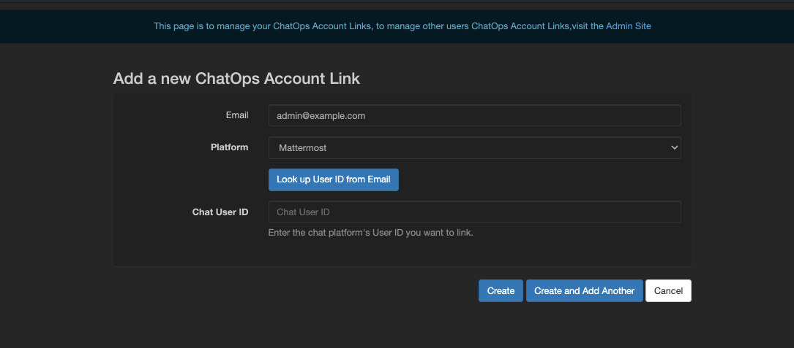

# Getting Started with the App

This document provides a step-by-step tutorial on how to get the App going and how to use it.

## Install the App

To install the App, please follow the instructions detailed in the [Administrator Guide](../admin/install.md).

## Link Nautobot Account

+++ 3.0.0

Nautobot ChatOps now uses the built-in Nautobot permissions for Nautobot Objects (Devices, Locations, Racks, etc.). Each user will need to link their Nautobot Account with their Chat Platform User Account. Login to Nautobot then access the Link ChatOps Account within the Plugins menu. Here you can provide your email address and select the ChatOps Platform you are using, then click the Look up User ID from Email to get your Chat User ID.

## Built-in Commands

Each command can be invoked with `help` sub-command to display all sub-commands with the description.

### `/clear` Command

Scroll the chat history out of view. This command has no sub-commands.

### `/nautobot` Command

Interact with Nautobot by utilizing the following sub-commands:

| Command | Arguments | Description |
| ------- | --------- | ----------- |
| `about` || Provide a link for more information on Nautobot Apps. |
| `change-device-status` | `[device-name]` `[status]` | Set the status of a device in Nautobot. |
| `get-circuit-connections` | `[provider-slug]` `[circuit-id]` | For a given circuit, find the objects the circuit connects to. |
| `get-circuit-providers` || Get a list of circuit providers. |
| `get-circuits` | `[filter-type]` `[filter-value]` | Get a filtered list of circuits from Nautobot. |
| `get-device-facts` | `[device-name]` | Get detailed facts about a device from Nautobot in YAML format. |
| `get-device-status` | `[device-name]` | Get the status of a device in Nautobot. |
| `get-devices` | `[filter-type]` `[filter-value]` | Get a filtered list of devices from Nautobot. |
| `get-interface-connections` | `[filter-type]` `[filter-value-1]` `[filter-value-2]` | Return a filtered list of interface connections based on filter type, `filter_value_1` and/or `filter_value_2`. |
| `get-manufacturer-summary` || Provides a summary of each manufacturer and how many devices have that manufacturer. |
| `get-rack` | `[site-slug]` `[rack-id]` | Get information about a specific rack from Nautobot. |
| `get-vlans` | `[filter-type]` `[filter-value-1]` | Return a filtered list of VLANs based on filter type and/or `filter_value_1`. |

!!! note
    All sub-commands are intended to be used with the `nautobot` prefix. For example, to retrieve a filtered list of VLANs, use the command `/nautobot get-vlans`.

+/- 3.0.0
    Due to the removal of slug in Nautobot 2.0, the command shortcuts will use the PK value of an object. This will be
    changed to the Natural Key or PK in an upcoming release.

### Integrations Commands

The `nautobot-chatops` package includes multiple integrations. Each integration adds chat commands described here:

- [Cisco ACI](./integrations/aci.md)
- [AWX / Ansible Tower](./integrations/ansible.md)
- [Arista CloudVision](./integrations/aristacv.md)
- [Grafana](./integrations/grafana.md)
- [IPFabric](./integrations/ipfabric.md)
- [Cisco Meraki](./integrations/meraki.md)
- [Cisco NSO](./integrations/nso.md)
- [Palo Alto Panorama](./integrations/panorama.md)
