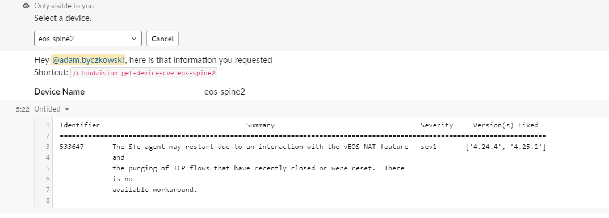

# Arista CloudVision Chat Commands

## `/cloudvision` Command

Interact with Arista CloudVision by utilizing the following sub-commands:

| Command | Arguments | Description |
| ------- | --------- | ----------- |
| `get-devices-in-container` | `[container_name]` | Get a list of devices in a Cloudvision container. |
| `get-configlet` | `[configlet_name]` | Get configuration of a specified configlet. |
| `get-device-configuration` | `[device_name]` | Get running configuration of a specified device. |
| `get-task-logs` | `[task_id]` | Get logs of a specified task. |
| `get-applied-configlets` | `[filter_type]` `[filter_value]` | Get configlets applied to either a device or a container. |
| `get-active-events` | `[filter_type]` `[filter_value]` `[start_time]` `[end_time]` | Get active events with specified criteria. |
| `get-tags` | `[device_name]` | Get system or user tags assigned to a device. |
| `get-device-cve` | `[device_name]` | Get CVEs Cloudvision has found for a device or a list of all devices with CVEs. |

!!! note
    All sub-commands are intended to be used with the `/cloudvision` prefix.

## Screenshots

