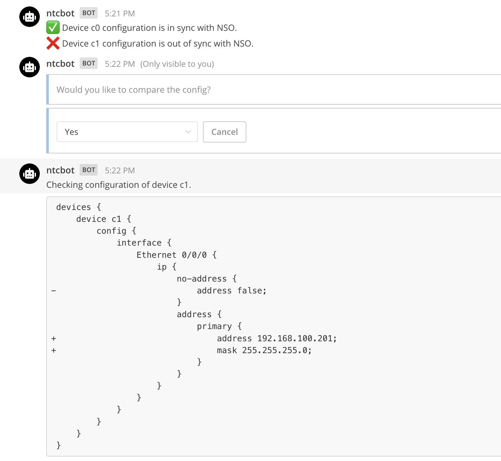
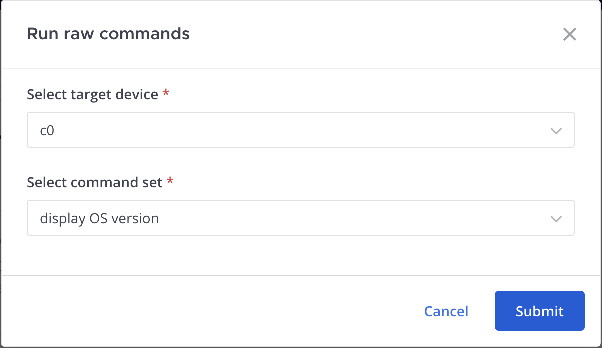
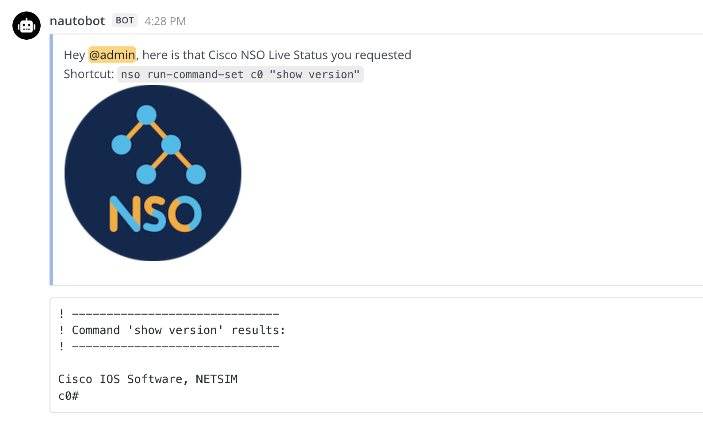

# Cisco NSO Chat Commands

## `/nso` Command

Interact with Cisco NSO by utilizing the following sub-commands:

| Command           | Arguments                          | Description                           |
| ----------------- | ---------------------------------- | --------------------------------------|
| `ping`            | `[device-name]`                    | Ping a device.                                              |
| `connect`         | `[device-name]`                    | Check device connection with NSO.                           |
| `check-sync`      | `[device-name]` `[compare-config]` | Check sync between current device config and stored in NSO. |
| `run-commands`    | `[device-name]` `[commands]`       | Run commands on a device.                                   |
| `run-command-set` | `[device-name]` `[commands]`       | Run predefined set of commands on a device.                 |

!!! note
    All sub-commands are intended to be used with the `/nso` prefix.

## Screenshots

