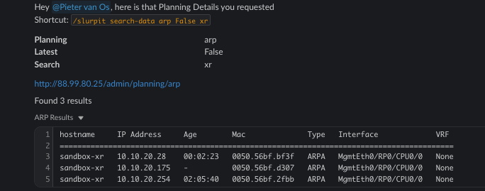

# Slurpit Chat Commands

## `/slurpit` Command

Interact with [Slurpit](https://slurpit.io) by utilizing the following sub-commands:

| Command           | Arguments                            | Description                             |
| ----------------- | ------------------------------------ | --------------------------------------- |
| `get-devices`     |                                      | Slurpit inventory device list.          |
| `get-device`      | `[hostname]`                         | Slurpit device information.             |
| `get-sites`       |                                      | Slurpit site list.                      |
| `get-plannings`   |                                      | Configured plannings.                   |
| `search-data`     | `[planning]` `[latest]` `[search]`   | Search planning data.                   |
| `device-data`     | `[planning]` `[latest]` `[hostname]` | Get planning data for a given hostname. |

!!! note
    All sub-commands are intended to be used with the `/slurpit` prefix.

## Screenshots

