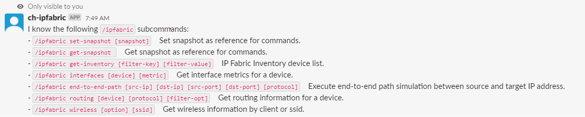
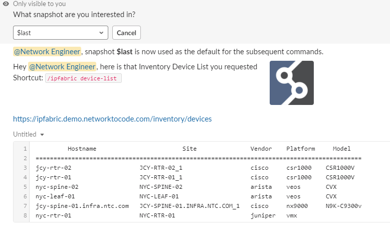
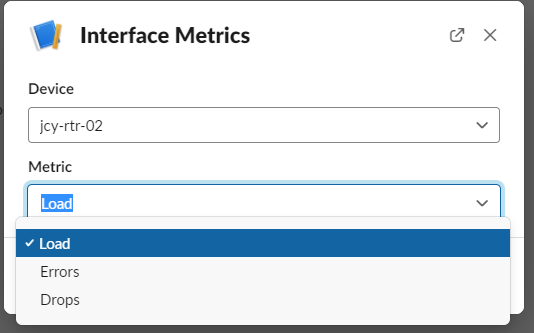
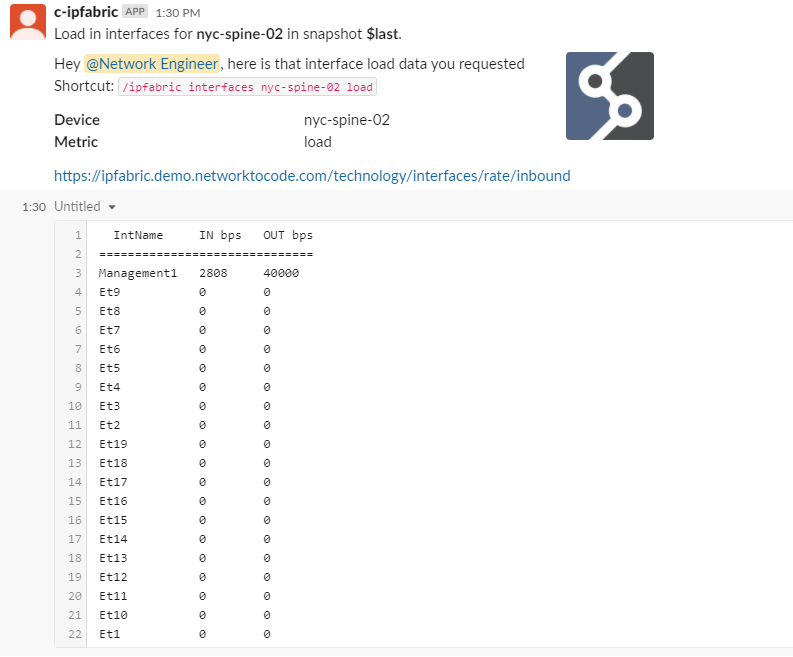
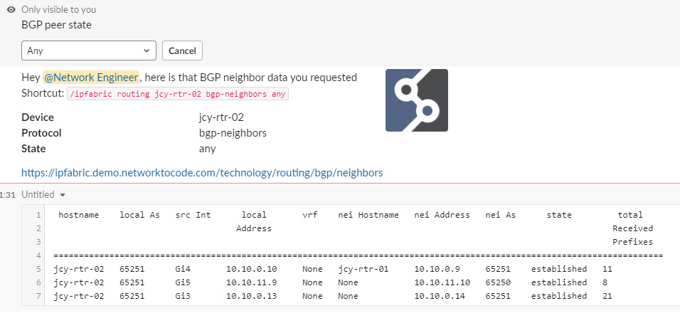
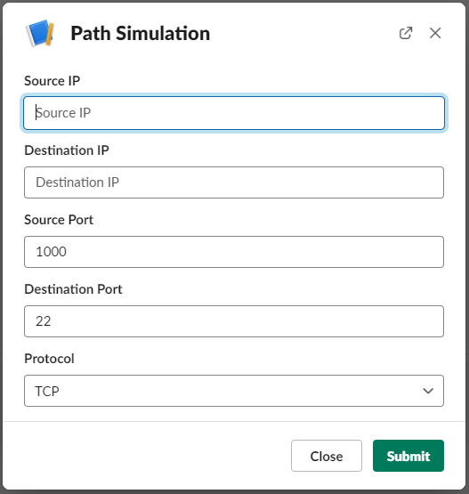
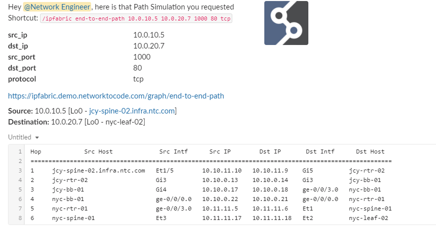

# IPFabric Chat Commands

## `/ipfabric` Command

Interact with IPFabric by utilizing the following sub-commands:

| Command | Arguments | Description |
| ------- | --------- | ----------- |
| `set-snapshot` | `[snapshot: str]` | Set snapshot as reference for commands. |
| `get-snapshot` | | Get snapshot as reference for commands. |
| `get-loaded-snapshots` | | IP Fabric Loaded Snapshot list. |
| `get-inventory` | `[filter_key=None]` `[filter_value=None]` | IP Fabric Inventory device list. |
| `interfaces` | `[device=None]` `[metric=None]` | Get interface metrics for a device. |
| `pathlookup` | `[src_ip]` `[dst_ip]` `[src_port]` `[dst_port]` `[protocol]` | Path simulation diagram lookup between source and target IP address. |
| `pathlookup-icmp` | `[src_ip]` `[dst_ip]` `[icmp_type]` | Path simulation diagram lookup between source and target IP address. |
| `routing` | `[device=None]` `[protocol=None]` `[filter_opt=None]` | Get routing information for a device. |
| `wireless` | `[option=None]` `[ssid=None]` | Get wireless information by client or ssid. |
| `find-host` | `[filter_key=None]` `[filter_value=None]` | Get host information using the inventory host table. |
| `table-diff` | `[category]` `[table]` `[view]` `[snapshot]` | Get difference of a table between the current snapshot and the specified snapshot. |

!!! note
    All sub-commands are intended to be used with the `/ipfabric` prefix.

IP Fabric uses a concept of snapshots which can include different devices and data. The plugin supports querying specific snapshots via the `/ipfabric set-snapshot` command. The snapshot is set per user and cached for all future commands. If a snapshot is not set, the commands will default to `$last` unless a specific snapshot id is required.

## Screenshots

