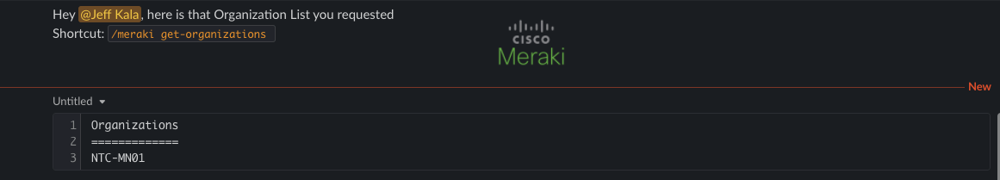
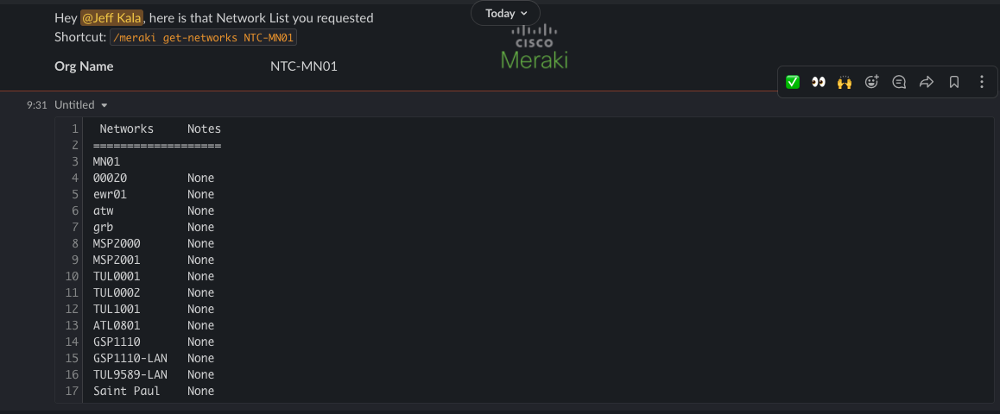
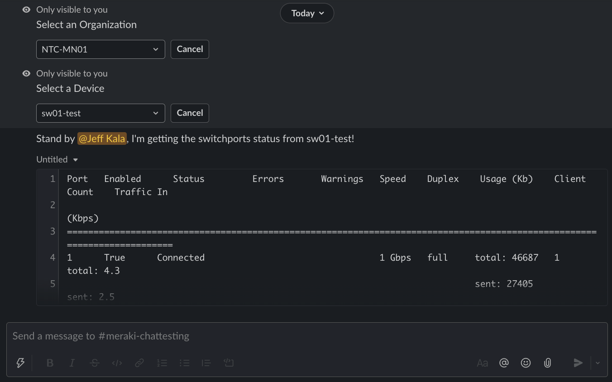
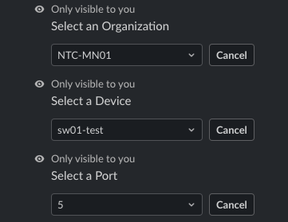
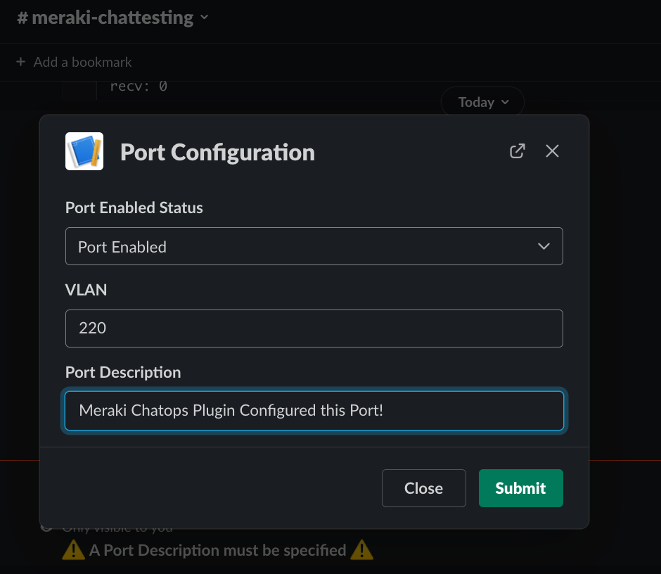
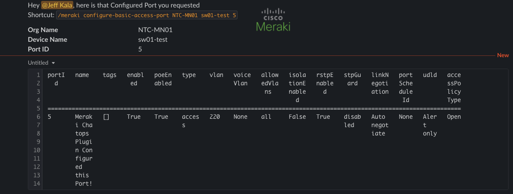

# Cisco Meraki Chat Commands

## `/meraki` Command

Interact with Cisco Meraki by utilizing the following sub-commands:

| Command | Arguments | Description |
| ------- | --------- | ----------- |
| `get-organizations` |  | Gather all the Meraki Organizations. |
| `get-admins` | `[org_name]` | Based on an Organization Name Return the Admins. |
| `get-devices` | `[org_name]` `[device_type]` | Gathers devices from Meraki. |
| `get-networks` | `[org_name]` | Gathers networks from Meraki. |
| `get-switchports` | `[org_name]` `[device_name]` | Gathers switch ports from a MS switch device. |
| `get-switchports-status` | `[org_name]` `[device_name]` | Gathers switch ports status from a MS switch device. |
| `get-firewall-performance` | `[org_name]` `[device_name]` | Query Meraki with a firewall to device performance. |
| `get-wlan-ssids` | `[org_name]` `[net_name]` | Query Meraki for all SSIDs for a given Network. |
| `get-camera-recent` | `[org_name]` `[device_name]` | Query Meraki Recent Camera Analytics. |
| `get-clients` | `[org_name]` `[device_name]` | Query Meraki for List of Clients. |
| `get-neighbors` | `[org_name]` `[device_name]` | Query Meraki for List of LLDP or CDP Neighbors. |
| `configure-basic-access-port` | `[org_name]` `[device_name]` `[port_number]` `[enabled]` `[vlan]` `[port_desc]` | Configure an access port with description, VLAN and state. |
| `cycle-port` | `[org_name]` `[device_name]` `[port_number]` | Cycle a port on a switch. |

!!! note
    All sub-commands are intended to be used with the `/meraki` prefix.

## Screenshots

Running `/meraki get-organizations`.



Running `/meraki get-networks`.



Running `/meraki get-switchports-status`.



Since the output was cut off the output example is below:

```
Port   Enabled      Status         Errors       Warnings   Speed    Duplex    Usage (Kb)    Client Count    Traffic In
                                                                                                              (Kbps)
========================================================================================================================
1      True      Connected                                 1 Gbps   full     total: 46687   1              total: 4.3
                                                                             sent: 27405                   sent: 2.5
                                                                             recv: 19282                   recv: 1.8
2      True      Connected                                 1 Gbps   full     total: 10086   1              total: 1.0
                                                                             sent: 9481                    sent: 0.9
                                                                             recv: 605                     recv: 0.1
3      True      Disconnected   Port                                         total: 0       0              total: 0
                                disconnected                                 sent: 0                       sent: 0
                                                                             recv: 0                       recv: 0
4      True      Disconnected   Port                                         total: 0       0              total: 0
                                disconnected                                 sent: 0                       sent: 0
                                                                             recv: 0                       recv: 0
```

To demonstrate a example of configuration updates.  There is a simple configuration ability for access ports.
`/meraki configure-basic-access-port`

Specify Org, Switch, and Port ID.



Fill out the Port Specific Configuration.



Result of the configuration.


