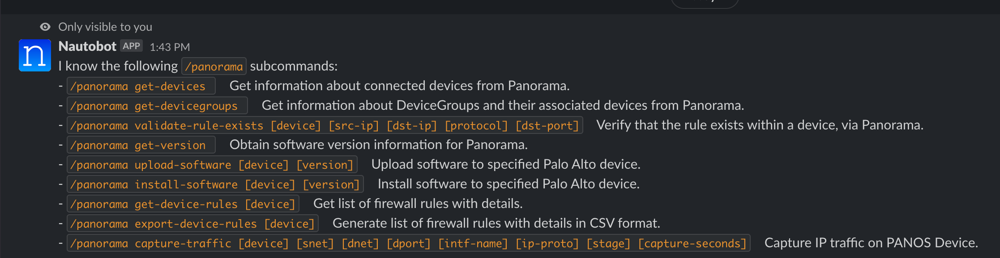
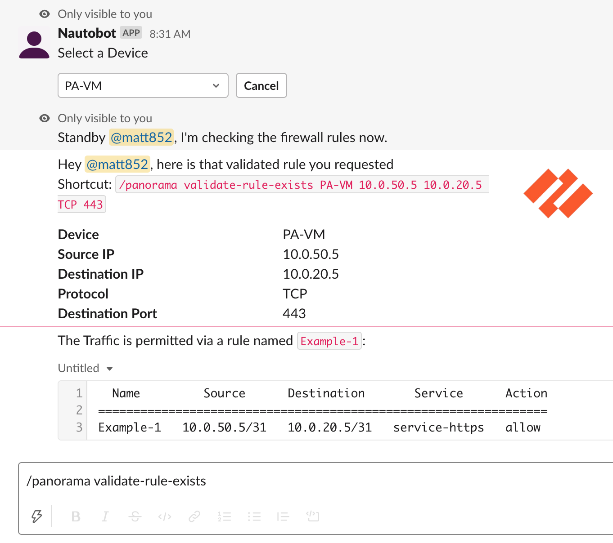
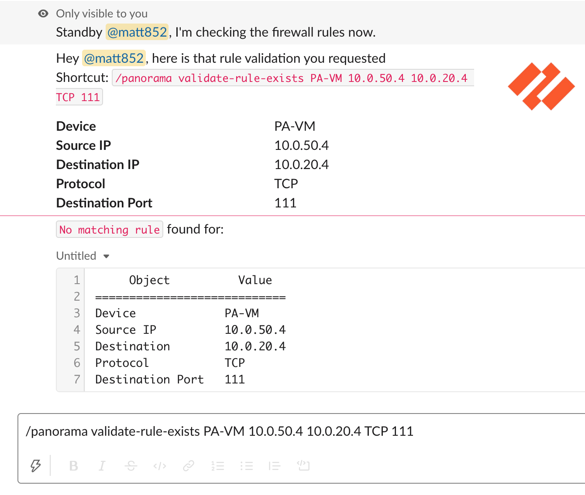
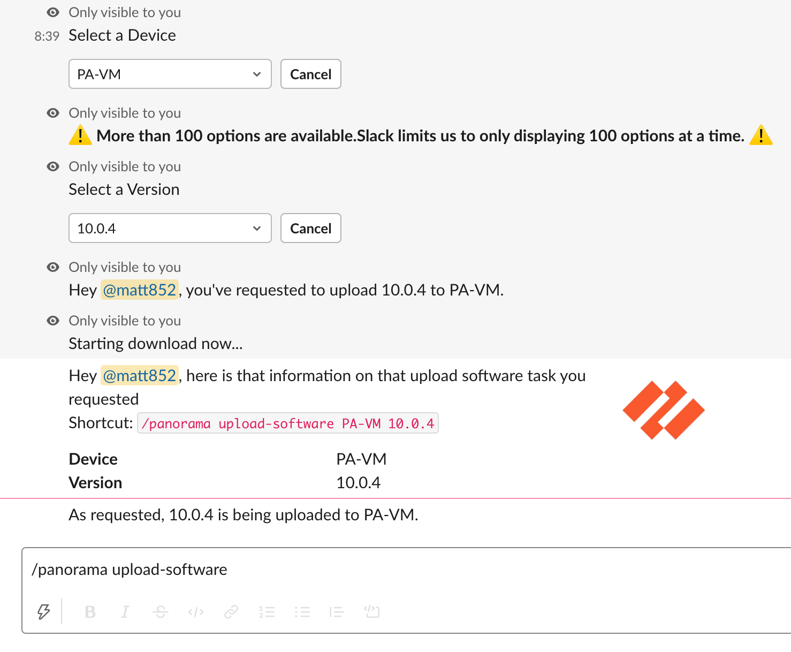
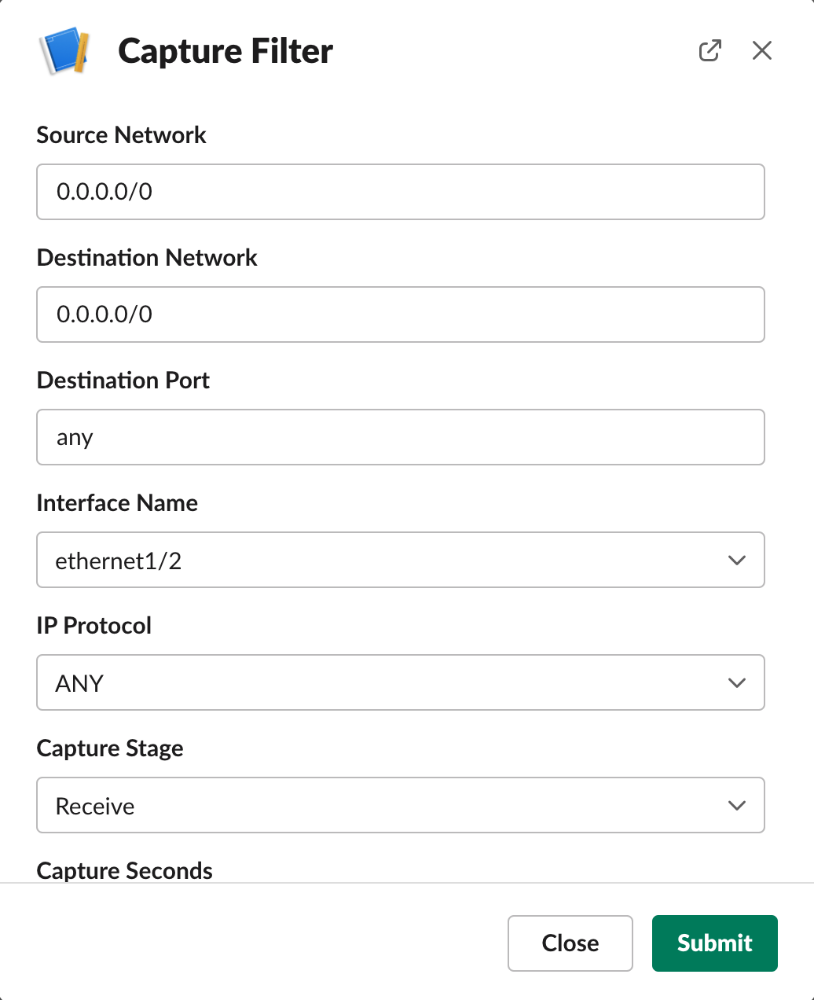
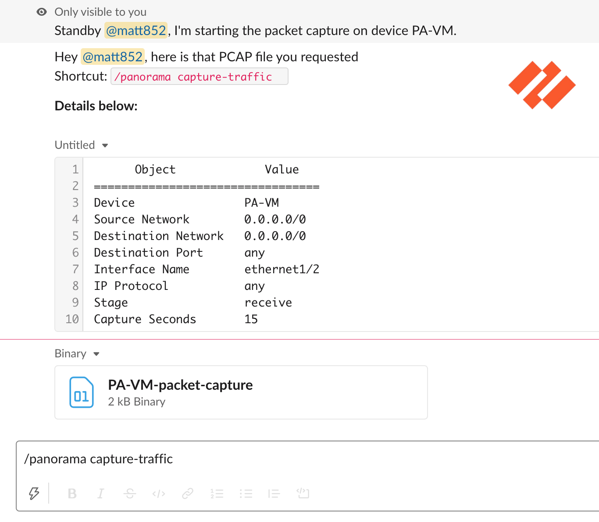
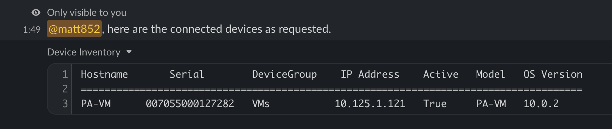
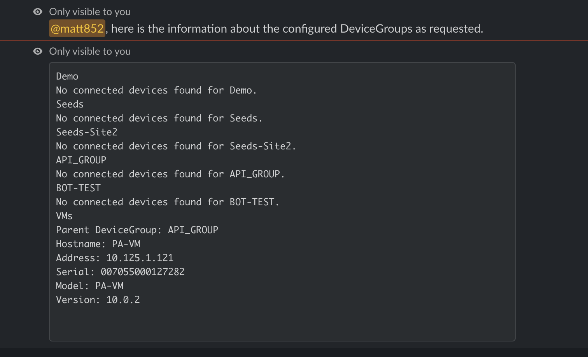
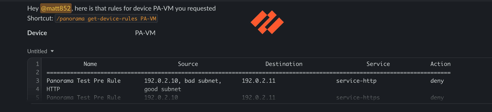

# Palo Alto Panorama Chat Commands

## `/panorama` Command

Interact with Palo Alto Panorama by utilizing the following sub-commands:

| Command | Arguments | Description |
|-------- | --------- | ----------- |
| `get_devices` | | Get information about connected devices from Panorama. |
| `get_devicegroups` |  | Get information about DeviceGroups and their associated devices from Panorama. |
| `validate_rule_exists` | `[device]` `[src_ip]` `[dst_ip]` `[protocol]` `[dst_port]` | Verify that the rule exists within a device, via Panorama. |
| `get_version` |  | Obtain software version information for Panorama. |
| `upload_software` | `[device]` `[version]` | Upload software to specified Palo Alto device. |
| `install_software` | `[device]` `[version]` | Install software to specified Palo Alto device. |
| `get_device_rules` | `[device]` | Get list of firewall rules with details. |
| `export_device_rules` | `[device]` | Generate list of firewall rules with details in CSV format. |
| `capture_traffic` | `[device]` `[snet]` `[dnet]` `[dport]` `[intf_name]` `[ip_proto]` `[stage]` `[capture_seconds]` | Capture IP traffic on PANOS Device. |

!!! note
    All sub-commands are intended to be used with the `/panorama` prefix.

## Screenshots

